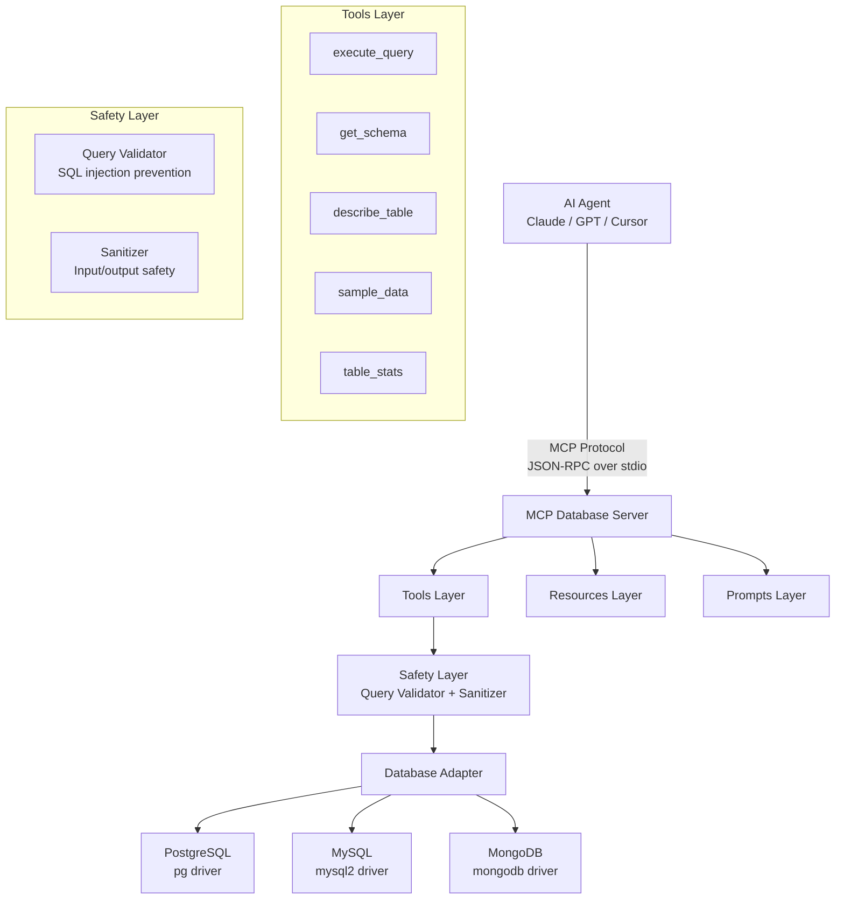

# mcp-database-server

[](LICENSE)
[](https://www.typescriptlang.org/)
[](https://nodejs.org/)
[](https://modelcontextprotocol.io/)

A production-ready **Model Context Protocol (MCP)** server that enables AI agents (Claude, GPT, Cursor) to securely query and analyze databases using natural language.

## What is MCP?

The **Model Context Protocol (MCP)** is an open standard that allows AI assistants to connect to external tools and data sources. Think of it as a USB-C port for AI — a universal interface that lets any AI model talk to any tool. This server implements MCP to give AI agents safe, read-only access to your databases.

## Features

- **Multi-database support** — PostgreSQL, MySQL, MongoDB
- **Read-only by default** — Only SELECT queries allowed unless explicitly enabled
- **SQL injection prevention** — Query validation, input sanitization, dangerous pattern detection
- **5 powerful tools** — Query, schema, describe, sample data, table stats
- **AI-friendly output** — Markdown tables, JSON, CSV formats
- **MCP resources** — Expose database schema as a readable resource
- **MCP prompts** — Built-in query helper for AI agents
- **Configurable safety** — Row limits, query timeouts, write protection
- **Docker ready** — Multi-stage build with sample PostgreSQL database

## Quick Start

```bash
# Clone and install
git clone <repo-url> && cd mcp-database-server
npm install

# Configure your database
cp .env.example .env
# Edit .env with your database credentials

# Build and start
npm run build
node build/index.js
```

## Installation

```bash
npm install
npm run build
```

## Configuration

All configuration is via environment variables:

| Variable | Default | Description |
|----------|---------|-------------|
| `DB_TYPE` | `postgresql` | Database type: `postgresql`, `mysql`, `mongodb` |
| `DB_HOST` | `localhost` | Database host |
| `DB_PORT` | `5432` | Database port |
| `DB_NAME` | `mydb` | Database name |
| `DB_USER` | `postgres` | Database user |
| `DB_PASSWORD` | _(empty)_ | Database password |
| `DB_SSL` | `false` | Enable SSL connection |
| `ALLOW_WRITE` | `false` | Allow INSERT/UPDATE/DELETE queries |
| `MAX_ROWS` | `1000` | Maximum rows per query result |
| `QUERY_TIMEOUT` | `30000` | Query timeout in milliseconds |
| `LOG_LEVEL` | `info` | Log level: `debug`, `info`, `warn`, `error` |

## Usage

### Claude Desktop

Add to your `claude_desktop_config.json`:

```json
{
  "mcpServers": {
    "database": {
      "command": "node",
      "args": ["/absolute/path/to/mcp-database-server/build/index.js"],
      "env": {
        "DB_TYPE": "postgresql",
        "DB_HOST": "localhost",
        "DB_PORT": "5432",
        "DB_NAME": "mydb",
        "DB_USER": "postgres",
        "DB_PASSWORD": "your_password"
      }
    }
  }
}
```

### Cursor IDE

Add to your Cursor MCP settings:

```json
{
  "mcpServers": {
    "database": {
      "command": "node",
      "args": ["/absolute/path/to/mcp-database-server/build/index.js"],
      "env": {
        "DB_TYPE": "postgresql",
        "DB_HOST": "localhost",
        "DB_PORT": "5432",
        "DB_NAME": "mydb",
        "DB_USER": "postgres",
        "DB_PASSWORD": "your_password"
      }
    }
  }
}
```

### Claude Code CLI

```bash
# Run directly
DB_TYPE=postgresql DB_HOST=localhost DB_NAME=mydb DB_USER=postgres DB_PASSWORD=pass node build/index.js
```

## Tools

### `execute_query`

Execute a SQL query against the database.

**Input:**
```json
{ "query": "SELECT name, email FROM users LIMIT 5", "format": "table" }
```

**Output:**
```
name  | email
----- | -----------------
Alice | alice@example.com
Bob   | bob@example.com

_2 row(s) returned in 12ms._
```

### `get_schema`

Get the full database schema.

**Input:**
```json
{ "schema": "public" }
```

**Output:** Markdown with all tables, columns, types, keys, indexes.

### `describe_table`

Get detailed information about a specific table.

**Input:**
```json
{ "table_name": "users" }
```

**Output:** Column details, constraints, sample values, indexes.

### `sample_data`

Get sample rows from a table.

**Input:**
```json
{ "table_name": "orders", "limit": 5 }
```

**Output:** Formatted markdown table with sample rows.

### `table_stats`

Get statistics for tables.

**Input:**
```json
{ "table_name": "users" }
```

**Output:** Row count, table size, column count, index count.

## Docker Setup

```bash
# Start server with PostgreSQL and seed data
cd docker
docker-compose up -d

# The PostgreSQL database will be seeded with an ecommerce sample:
# - users (20 rows)
# - products (22 rows)
# - orders (20 rows)
# - order_items (30 rows)
```

## Architecture



## Testing

```bash
# Run all tests
npm test

# Run tests in watch mode
npm run test:watch

# Test with MCP Inspector
npx @modelcontextprotocol/inspector node build/index.js
```

## Development

```bash
# Run in dev mode (auto-recompile)
npm run dev

# Build
npm run build

# Lint
npm run lint
```

## Project Structure

```
src/
├── index.ts              # Entry point — MCP server setup
├── config.ts             # Environment config with zod validation
├── databases/
│   ├── base.ts           # DatabaseAdapter interface
│   ├── index.ts          # Adapter factory
│   ├── postgresql.ts     # PostgreSQL adapter
│   ├── mysql.ts          # MySQL adapter
│   └── mongodb.ts        # MongoDB adapter
├── tools/
│   ├── query.ts          # execute_query tool
│   ├── schema.ts         # get_schema tool
│   ├── describe.ts       # describe_table tool
│   ├── sample.ts         # sample_data tool
│   └── stats.ts          # table_stats tool
├── resources/
│   └── schema-resource.ts # database://schema resource
├── prompts/
│   └── query-helper.ts   # query_helper prompt
├── safety/
│   ├── query-validator.ts # SQL safety validation
│   └── sanitizer.ts      # Input/output sanitization
└── utils/
    ├── formatter.ts      # Result formatting (table/json/csv)
    └── logger.ts         # Structured stderr logging
```

## Contributing

1. Fork the repository
2. Create a feature branch: `git checkout -b feature/my-feature`
3. Make your changes and add tests
4. Ensure all tests pass: `npm test`
5. Ensure the build succeeds: `npm run build`
6. Submit a pull request

## License

[MIT](LICENSE)
